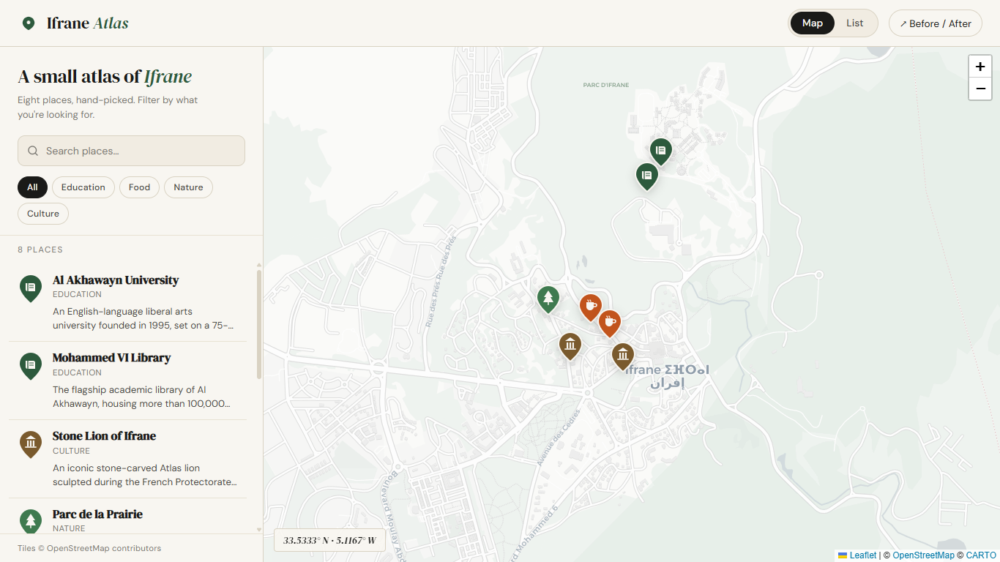
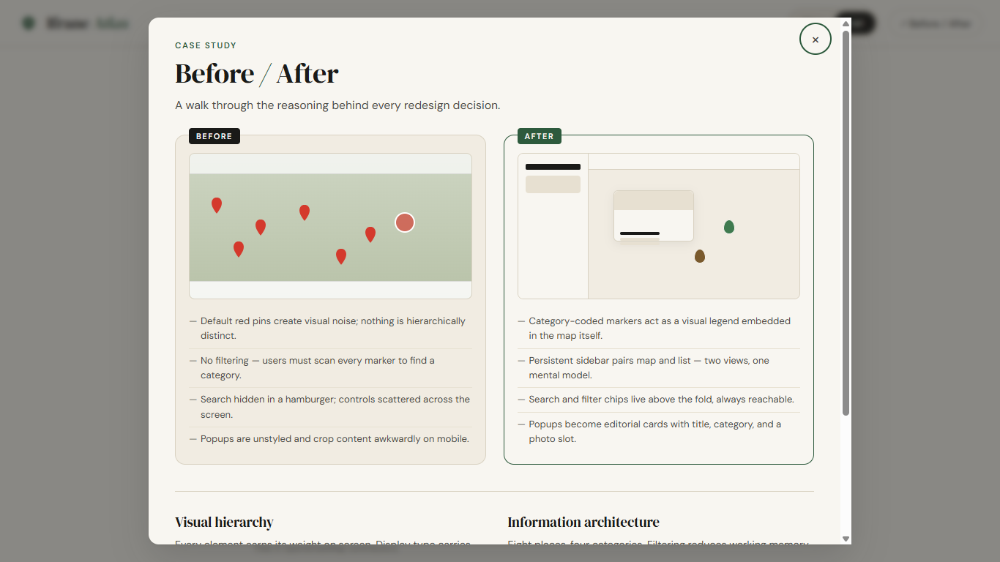
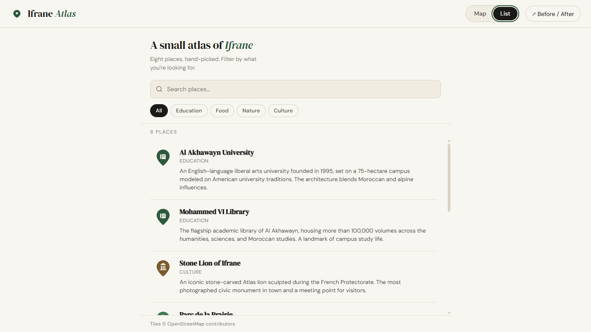

# Ifrane Atlas

> A redesigned interactive map of Ifrane, Morocco

A single-page web app, deployable to GitHub Pages without a build step. Eight hand-picked points of interest, four categories, custom SVG markers, accessible keyboard navigation, and a before/after rationale built into the interface.

---

# Ifrane Atlas — Interactive Map Redesign

🔗 **Live Demo:** [Open Website](https://mtaoumi.github.io/interactive-map-redesign/)

Interactive map redesign of Ifrane, Morocco, focused on usability, accessibility, and spatial interface design.

---

## Screenshots

| Preview | Description |
| --- | --- |
|  | Desktop map view with sidebar |
|  | Before/after comparison modal |
|  | List view mode |

---

## Stack

- HTML, CSS, JavaScript , no framework, no build tools
- [Leaflet 1.9.4](https://leafletjs.com/) for map functionality
- OpenStreetMap tiles via [Carto Light Basemap](https://carto.com/) (cleaner palette than default OSM)
- Google Fonts: DM Serif Display (display) + DM Sans (body)
- Custom SVG marker icons, one per category

---

## Run locally

The app is fully static. Two options:

```bash
# Option A , any static server (recommended, so fetch() works on data/locations.json)
python3 -m http.server 8000
# then open http://localhost:8000

# Option B , open index.html directly (uses an embedded data fallback)
```

---


## Project structure

```
.
├── index.html              # Single-page entry
├── style.css               # Full stylesheet (tokens + components)
├── app.js                  # Leaflet setup, filters, search, view toggle
├── data/
│   └── locations.json      # 8 hand-picked POIs
├── assets/
│   ├── favicon.svg
│   ├── marker-education.svg
│   ├── marker-food.svg
│   ├── marker-nature.svg
│   └── marker-culture.svg
├── README.md
└── .gitignore
```

---

## Design rationale

### The original problem

The "before" reference was a generic geographic web app: red default Leaflet pins indistinguishable by category, controls scattered around the viewport, no filtering, search hidden behind a hamburger, popups that crop on mobile. A user looking for "where can I get a coffee" had to click every pin in sequence. That's a navigation failure dressed up as a map.

### Visual hierarchy , improving scannability

Three deliberate moves:

1. **Type pairing as hierarchy.** DM Serif Display carries the names of places; DM Sans carries everything else. The eye can scan the map's list and lock onto titles before reading meta or descriptions, because the typeface contrast alone signals importance. No need for size-only hierarchy or bold-stacking.
2. **One accent, used sparingly.** The green (`#2D5A3D`) is reserved for active selection, the brand mark, and the dividing punctuation in headings. Everything else is the cream/charcoal/line palette. Restricting the accent makes the signal-to-noise ratio of "what's selected right now" extremely high.
3. **Category-coded markers.** Each category has a distinct hue (green / rust / forest-green / ochre) plus a glyph (book / cup / tree / column). A user can read the map's category distribution at a glance , the markers act as both wayfinding pins and a legend.

### Information architecture , reducing cognitive load

The redesign assumes users arrive with one of two questions: *"what's near me?"* or *"where's the nearest [category]?"* Both are answered without leaving the viewport:

- **Filter chips** above the list act as a single-select facet. Choosing "Food" removes every non-food marker from the map and the list simultaneously , the two views never disagree.
- **Search** is a free-text overlay on top of the chip filter. Both compose: "food" + "rose" narrows to one item across both panels.
- **Map ↔ list bidirectional sync.** Clicking a list item flies the map and opens the popup; clicking a marker highlights its list row and scrolls it into view. The user maintains one mental model of "what's selected" across two representations.

This is Hick's Law in practice: chips reduce eight options to four, then to one. And it's recognition over recall , users don't need to remember which pins were cafés, the system remembers for them.

### Spatial design principles relevant to architectural computation

The layout is composed like a building plan:

- **A defined edge** (the sidebar) acts as a service core: persistent, narrow, dense with controls.
- **A public realm** (the map) takes the dominant area and is kept calm , tiles desaturated, only markers and one popup at a time competing for attention.
- **A threshold** (the topbar) handles transitions between modes (map ↔ list) and provides identity (brand, before/after access).
- **Adjacency without nesting.** Filters, search, and list are stacked vertically in the same column , they share an *edge*, not a *container*. This mirrors how plan adjacency creates relationships without hierarchy.

For a portfolio framed around architectural computation: the interface is a small spatial diagram in itself, and every layout decision corresponds to a decision an architect would make about programmatic zones in plan.

### Accessibility considerations

- **Skip-to-content link** appears on first Tab.
- **Keyboard-reachable everywhere.** Filter chips, list items, view toggles, modal close , all `Tab`-able. List items respond to `Enter` and `Space`.
- **ARIA semantics.** `role="tablist"` on the view toggle, `role="dialog"` and `aria-modal` on the rationale modal, `aria-label` on the map and the locations panel, descriptive `aria-label` on each list item containing both name and category.
- **Focus management.** Modal traps focus on open and restores it on close.
- **Visible focus ring.** A 2px green outline with 2px offset on every interactive element via `:focus-visible`.
- **Contrast.** All body text passes WCAG AA on the cream background (charcoal `#1A1A18` is ~16:1; `#4A4944` ~9:1; `#7A7872` ~4.7:1 , used only for non-essential meta).
- **Reduced motion.** A `prefers-reduced-motion` media query disables transitions and animations.
- **Semantic landmarks.** `<header>`, `<main>`, `<aside>`, `<section>`, `<footer>` so screen readers announce regions.
- **Touch targets.** All interactive elements ≥ 36px on the smallest axis on mobile.

---

## HCI principles applied

| Principle | Where it shows up |
|---|---|
| **Visibility of system status** | Result count updates live; active marker scales up; active list row turns green |
| **Match between system and real world** | Category names match how people actually talk ("Food", not "F&B") |
| **User control & freedom** | Map click clears selection; ESC closes modal; clear "All" chip resets filters |
| **Consistency** | Same green accent means "active" everywhere; same SVG marker on map and in list |
| **Recognition over recall** | Filter chips visible at all times; categories shown as colored markers, not memorised codes |
| **Flexibility & efficiency** | Power users can search; first-timers can browse chips; both lead to the same result |
| **Aesthetic & minimalist design** | One accent, two typefaces, generous whitespace, no decorative chrome |
| **Help users recognise & recover from errors** | Empty filter result shows a friendly message instead of a blank list |

---

## Customising the data

Edit `data/locations.json`. Each entry needs:

```json
{
  "id": "unique-slug",
  "title": "Display name",
  "category": "education | food | nature | culture",
  "lat": 33.5333,
  "lng": -5.1167,
  "description": "1–2 sentences.",
  "meta": "Short factual line shown under the title",
  "photoLabel": "Caption for the photo placeholder"
}
```

The same data is also embedded in `app.js` as a fallback for environments where `fetch()` is blocked (e.g. opening `index.html` via `file://`).

To add a new category, add an SVG to `assets/marker-<name>.svg`, add the slug to `CATEGORY_LABELS` in `app.js`, and add a chip in `index.html`.

---

## License

Code: MIT. Map tiles © OpenStreetMap contributors, © CARTO.
